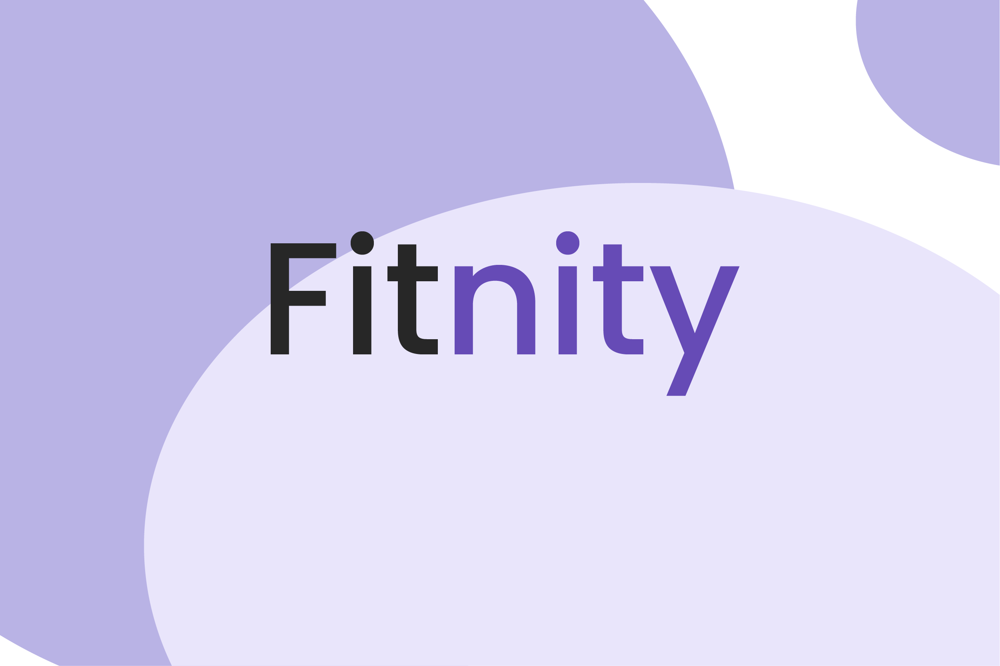

# Fitnity - Garuda Hacks 3.0 2022

Fitnity is a one stop application for discovering sports events and a sports-loving community while encouraging a healthy and active lifestyle. This is our hack submission for Garuda Hacks 3.0 2022.

## Inspiration

Nowadays, there are too many dedicated sports applications, for example, ones only for running. Hence, while we were brainstorming, we thought why not we have a one stop application to discover a wide range of sports activities while encouraging our society to practice a healthy lifestyle. People often feel lost when trying out new sports and might not have sports partners/cliques to do such recreations. That's where our idea comes into play where we believe there is a need for a place for the community to support each other and enjoy the sports together.

## What it does

Fitnity is a platform that helps user to scout for activities to join and suitable locations. With the help of natural language processing and AI, the platform guides users to better and quicker decision making with sentiment analysis and keyword extraction driven by the reviews of others.

Fitnity also allows you to create activities that will be added to the database in real time, allowing it to appear in other people’s searches. This further encourages other people to join each other's activities, overcoming the issue of no longer having a sports partner.

Lastly, Fitnity has a gamification feature where users can level up their game by collecting points after joining events to unlock trophies. With the trophies, users are given flexibility to customise their own dedicated trophy room that can be shared with their friends.

## How we built it

- Frontend Framework: React, HTML, CSS
- Backend Framework: Flask
- NLP Keyword Extraction Model: Yake
- Sentiment Analysis Model: SpaCy
- Database: Firestore, Firebase
- Frontend Hosting: Firebase Hosting
- Backend Deployment: Heroku

Non-serious answer: No sleep, stackoverflow, a lot of console.log() and print(), YouTube, GeeksforGeeks

## Challenges we ran into, Accomplishments and What we learned

We mostly ran into challenges of designing the logic for our trophy room page as we wanted to have a real dynamic experience of displaying the unlocked trophies based on the user's actual levels. Since it was also our first time working with a proper Firestore database, we also ran into challenges of learning to design the database. Regardless, overall, we were happy of what we managed to accomplish and managed to learn a lot about developing better full-stack applications with some implementation of AI (since we're AI majors ;)). We also learned to scope down our ideas based on the time limit and developed the ones we believed were a priority for the demo.

## What's next for Fitnity

Being a prototype, there are several features that we weren't able to complete within the time limit and hence, from a technical perspective, future steps would be the development of features such as registering new users, authentication and completing features to further complete the application.

From an application growth perspective, Fitnity envisions to collaborate with other event organisers and locations to provide incentives and rewards based on the intended point collection system. This opens up an opportunity to expand the application's network while encouraging users to continuously participate in activities. We also believe that the achievement system could have unlimited potential with the introduction of more personalised and limited edition trophies.

## Contributions

1. [Muhammad Afiq Irfan bin Manor](https://github.com/fiquee/)
2. [Tengku Ahmad Naim Nuruddin bin Tengku Mohd Azzman Shariffadeen](https://github.com/fiquee/)
