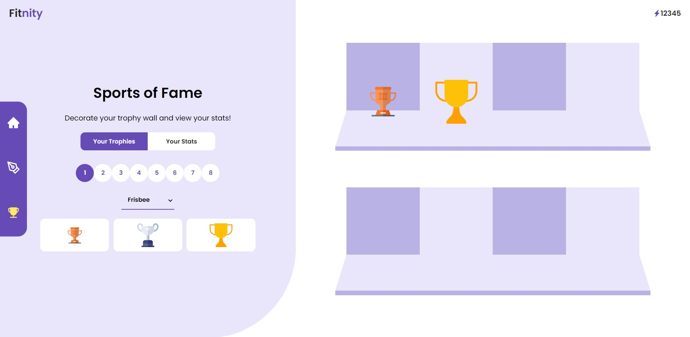

# Fitnity - Garuda Hacks 3.0 2022


At a glance, Fitnity is a one stop application for discovering sports events and a sports-loving community while encouraging a healthy and active lifestyle. Featuring NLP using sentiment analysis and keyword extraction on community reviews about locations to encourage better and quicker decision making and a gamified approach to encourage constant improvement of one's active habits. Fitnity - It's now time to be fit with the community!

This project was developed over 48 hours as a submission to Garuda Hacks 3.0 2022. Although we weren't selected as finalists in the highly competitive Health track, we were pleased to be acknowledged as an **honorable mention** among over a hundred submitted projects. 😁

## Inspiration

Nowadays, there are too many dedicated sports applications, for example, ones only for running. Hence, while we were brainstorming, we thought why not we have a one stop application to discover a wide range of sports activities while encouraging our society to practice a healthy lifestyle. People often feel lost when trying out new sports and might not have sports partners/cliques to do such recreations. That's where our idea comes into play where we believe there is a need for a place for the community to support each other and enjoy the sports together.

## What It Does

Fitnity is a platform that helps user to scout for activities to join and suitable locations. With the help of natural language processing and AI, the platform guides users to better and quicker decision making with sentiment analysis and keyword extraction driven by the reviews of others.

Fitnity also allows you to create activities that will be added to the database in real time, allowing it to appear in other people’s searches. This further encourages other people to join each other's activities, overcoming the issue of no longer having a sports partner.

Lastly, Fitnity has a gamification feature where users can level up their game by collecting points after joining events to unlock trophies. With the trophies, users are given flexibility to customise their own dedicated trophy room that can be shared with their friends.

## How We Built It

- Frontend Framework: React, HTML, CSS
- Backend Framework: Flask
- NLP Keyword Extraction Model: Yake
- Sentiment Analysis Model: SpaCy
- Database: Firestore, Firebase
- Frontend Hosting: Firebase Hosting
- Backend Deployment: Heroku

Non-serious answer: No sleep, stackoverflow, a lot of console.log() and print(), YouTube, GeeksforGeeks

## Challenges We Ran Into, Accomplishments and What We Learned

We mostly ran into challenges of designing the logic for our trophy room page as we wanted to have a real dynamic experience of displaying the unlocked trophies based on the user's actual levels. Since it was also our first time working with a proper Firestore database, we also ran into challenges of learning to design the database. Regardless, overall, we were happy of what we managed to accomplish and managed to learn a lot about developing better full-stack applications with some implementation of AI (since we're AI majors ;)). We also learned to scope down our ideas based on the time limit and developed the ones we believed were a priority for the demo.

## What's Next for Fitnity

Being a prototype, there are several features that we weren't able to complete within the time limit and hence, from a technical perspective, future steps would be the development of features such as registering new users, authentication and completing features to further complete the application.

From an application growth perspective, Fitnity envisions to collaborate with other event organisers and locations to provide incentives and rewards based on the intended point collection system. This opens up an opportunity to expand the application's network while encouraging users to continuously participate in activities. We also believe that the achievement system could have unlimited potential with the introduction of more personalised and limited edition trophies.

## Application Preview

**Home Page**


**Location Search Results Page**


**Sports of Fame Page**



## Deployment Notes

This is a personal reference on how this entire application was deployed. It could also serve as a note to others if you wish to use a similar stack.

### Frontend Deployment

The frontend for this application developed using React was deployed to Firebase hosting. To do this, the following was done:

1. In the frontend app folder, build the React project using the command:

   ```
   npm run build
   ```

   - To preview the build prior to deployment, the following sequence of commands can be used:

   ```
   npm install -g serve
   serve -s build
   ```

2. Follow the [documentation](https://firebase.google.com/docs/hosting) on setting up the site for hosting.
   - Generally, we just followed the steps prompted through `firebase init`
   - In our case, we created a new site in our Firebase project in order to match the name of our app. This site name was updated in our `firebase.json` configuration file.
   - Note that if you'd like to do the same, be sure to create this site first prior to using the `firebase deploy` command.
3. Once happy with the configuration, deploy the application using `firebase deploy`

### Backend Deployment

The backend of this application was built using Flask and deployed to Heroku.

> Warning: Heroku will no longer be providing free dynos for deployment and this may not be the best option for tight budget projects moving forward.

> Note: Although this repository houses both the frontend and backend, [deployment using the Git method](https://devcenter.heroku.com/articles/git) on Heroku required separating the backend folder. There may be a better way to do this but it was a quick and dirty way for us to work with it.

These steps were followed when deploying the backend for this application:

1. Install the Heroku CLI and get authenticated.
2. Create a Heroku project (you can also do this from the CLI)
3. In our case where a service account was used to interact with Firestore, we converted the service account details into environemnt variables and added them to our app's `Config Vars`. This can be found under the Settings of the app.
4. Using the Git method of deployment, the repository with the backend should be initialised as a Git repo and connected to a remote Heroku repository. The command for this is:
   ```
   heroku git:remote -a <APP_NAME>
   ```
5. Commit your changes and make a push to the Heroku remote repository. This will automatically handle the deployment process.
   ```
   git push heroku main
   ```

Note: For a Flask app, what we found to be necessary was the following lines of code at the bottom of your script:

```
if __name__ == '__main__':
    app.run()
```

## Contributors

1. [Muhammad Afiq Irfan bin Manor](https://github.com/fiquee/)
2. [Tengku Ahmad Naim Nuruddin bin Tengku Mohd Azzman Shariffadeen](https://github.com/tengznaim/)
